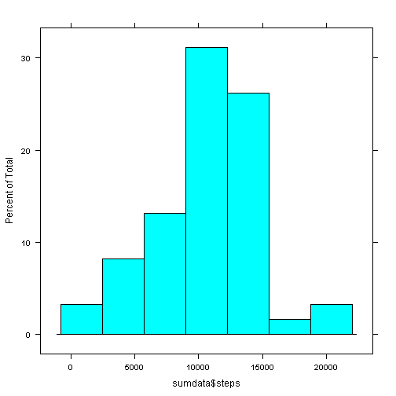
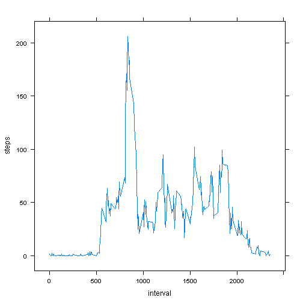
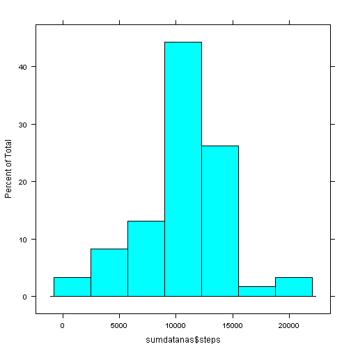
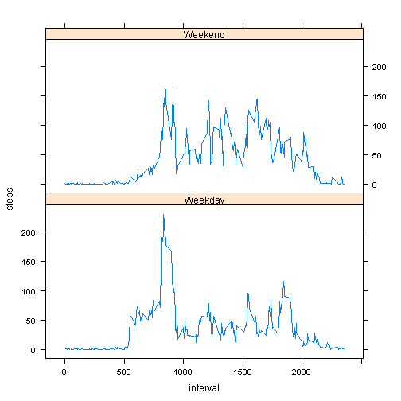

# Reproducible Research-Project1
August 17,2014

loading required libraries

```r
##install.packages(c("reshape2","reshape","lattice"))
library(reshape2)
library(reshape)
library(lattice)
```
Reading the data is clean and did not require additional manipulation 

```r
activity <- read.csv("activity.csv")
```

## What is mean total number of steps taken per day?  
Melt groups by date and cast then sums each day

```r
sumdata <- cast(melt(activity),date ~ ..., sum)
```

```
## Using date as id variables
```

A histogram of the total number of steps taken each day:

```r
histogram(~sumdata$steps)
```

 


```r
summean <- mean(sumdata$steps, na.rm = TRUE)
summedian <- median(sumdata$steps, na.rm = TRUE)
```
The mean of the total number of steps taken per day is 1.0766 &times; 10<sup>4</sup>.  
The median of the total number of steps taken per day is 10765.  

## What is the average daily activity pattern?


```r
meanbyinterval <- aggregate(. ~ interval, data = activity, mean)
```

A time series plot of the 5-minute interval (x-axis) and the average number of steps taken, averaged across all days 

```r
with(meanbyinterval, xyplot(steps ~ interval, type = "l"))
```

 


```r
maxsteps <- with(meanbyinterval, interval[steps == max(steps)])
```
### Which 5-minute interval, on average across all the days in the dataset, contains the maximum number of steps?
835

## Inputting missing values


```r
missing <- sum(is.na(activity$steps))
```
Total number of missing values is 2304.  

I have decided to fill in NAs with 5-min interval average

```r
activitynas <- activity
nrows <- as.numeric(nrow(activitynas))
for (i in seq_along(1:nrows)){
  if (is.na(activitynas[i,"steps"]))
    activitynas[i,"steps"] <- meanbyinterval[meanbyinterval$interval == activitynas[i,"interval"],"steps"]
  }
```
My new dataset, activitynas, now has no NA values.

I now preform the same analysis as I first did on the original dataset

```r
sumdatanas <- cast(melt(activitynas),date ~ ..., sum)
```

```
## Using date as id variables
```

```r
stepsmeanna <- mean(sumdatanas$steps, na.rm = TRUE)
stepsmedianna <- median(sumdatanas$steps, na.rm = TRUE)
```

A histogram of the total number of steps taken each day:

```r
histogram(~sumdatanas$steps)
```

 

The mean of the total number of steps taken per day is 1.0766 &times; 10<sup>4</sup>.  
The median of the total number of steps taken per day is 1.0766 &times; 10<sup>4</sup>. 
### Do these values differ from the estimates from the first part of the assignment? 
The median differs and becomes in line with the mean.
### What is the impact of inputting missing data on the estimates of the total daily number of steps?
Since I used the mean of the number of steps per interval to populate the missing values, it caused the median to move in line with the mean, which means the data is evenly divided around the mean.

## Are there differences in activity patterns between weekdays and weekends?
Creating a new factor variable in the dataset with two levels - "weekday" and "weekend".

```r
dateasdate <- strptime(activitynas$date, "%Y-%m-%d")
activitynas$weekday <- weekdays(dateasdate)
nrows <- as.numeric(nrow(activitynas))
for (i in seq_along(1:nrows)){
  if (activitynas[i,"weekday"] == "Saturday" || activitynas[i,"weekday"] == "Sunday")
    activitynas[i,"weekdayorend"] <- c("Weekend")
  else
    activitynas[i,"weekdayorend"] <- c("Weekday")
}
activitynas$weekday <- NULL
meanbyintervalnas <- aggregate(. ~ interval+weekdayorend, data = activitynas, mean)
```
Time series plot of the 5-minute interval (x-axis) and the average number of steps taken, averaged across all weekday days or weekend days (y-axis). 

```r
with(meanbyintervalnas, xyplot(steps ~ interval|weekdayorend, type = "l", layout = c(1, 2)))
```

 

The plot above shows the difference in activity patterns between weekdays and weekends.
